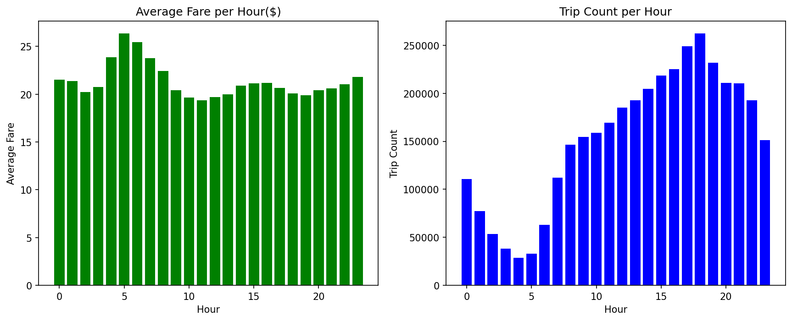
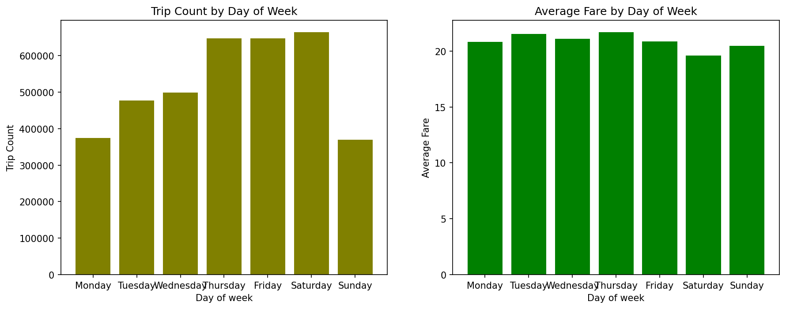
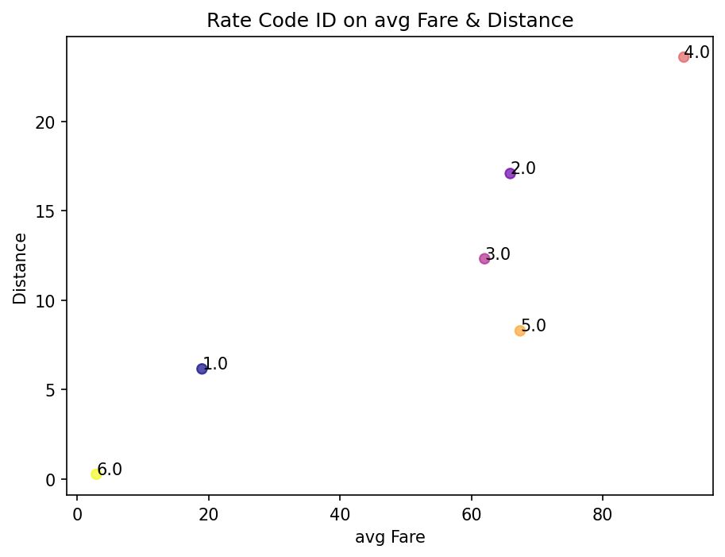
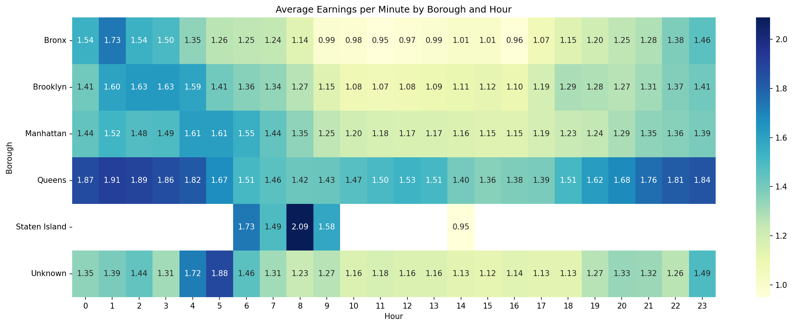
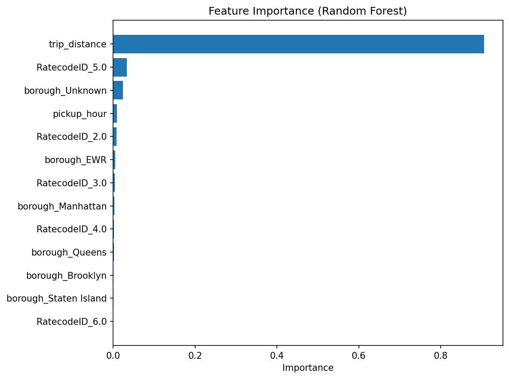
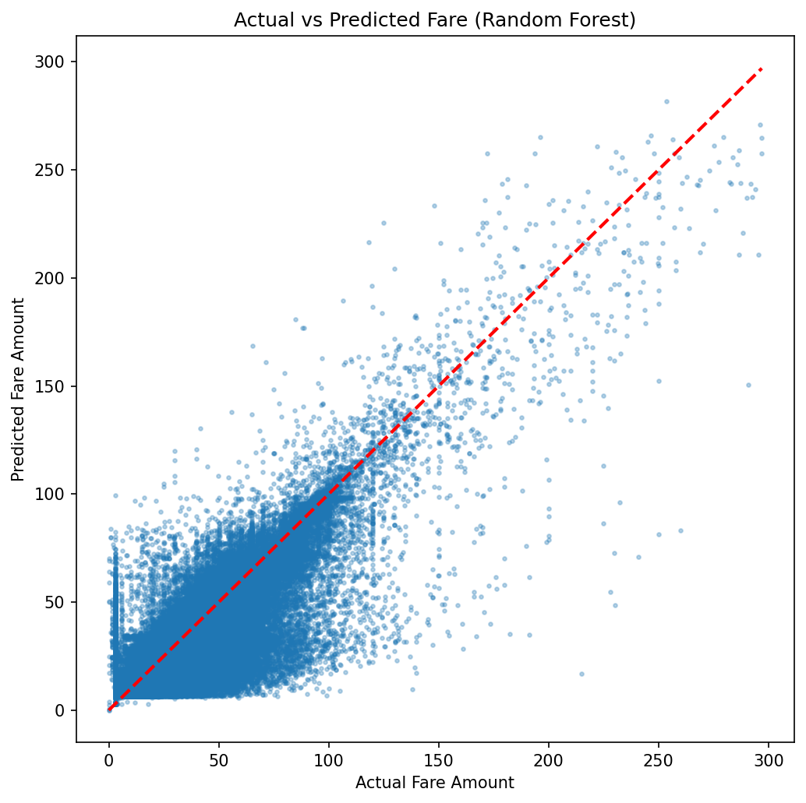

# NYC Yellow Taxi — Driver & Fleet Profitability Analytics

> 🚧 **Status:** Core analysis (data cleaning, EDA, SQL modeling, ML) is complete. Power BI dashboard is in progress.

An end-to-end data analytics project that turns raw NYC taxi trip records into actionable insights for **drivers** and **ride-hailing / taxi companies** — answering the question: *"Where and when should I drive (or place my fleet) to maximize earnings?"*

---

## Motivation

Most public taxi-data projects stop at generic exploratory charts. This project was built around a concrete business use case instead:

- **For individual drivers:** identify which boroughs and hours of the day yield the best return per minute of driving — not just the highest average fare, but earnings *relative to trip duration*, so drivers can plan their working hours and areas more efficiently and estimate their expected income.
- **For taxi / ride-hailing companies (e.g. Uber-style fleets):** identify the time windows and zones where demand is highest, to help decide where to allocate more vehicles. (Note: the dataset only contains completed trips, not unmet demand or fleet size — see *Limitations* below.)

## Dataset

- **Source:** [NYC Taxi & Limousine Commission (TLC) Trip Record Data](https://www.nyc.gov/site/tlc/about/tlc-trip-record-data.page) — official public dataset.
- **Data used for analysis:** Yellow Taxi trip records, January 2026.
- **Reproducibility:** the notebook includes a parameterized download function — any user can request a different month/year and the corresponding file is fetched automatically, instead of the pipeline being hardcoded to one static file.

```python
def download_taxi_data(year: int, month: int) -> str:
    """Downloads the NYC TLC Yellow Taxi parquet file for a given year/month
    and returns the local file path."""
    url = f"https://d37ci6vzurychx.cloudfront.net/trip-data/yellow_tripdata_{year}-{month:02d}.parquet"
    ...
```

## Tech Stack

| Layer | Tools |
|---|---|
| Data cleaning & EDA | Python, pandas, matplotlib |
| Data modeling | SQLite (star schema: fact + dimension tables) |
| Analysis | SQL (JOINs, GROUP BY, aggregate queries) |
| Machine Learning | scikit-learn (Linear Regression, Random Forest) |
| Dashboard | Power BI *(in progress)* |

## Pipeline / Architecture

```
Raw parquet (TLC)
   │
   ▼
Data Cleaning (pandas)          → duplicate removal, invalid RatecodeID fix,
   │                              datetime feature extraction
   ▼
Exploratory Data Analysis        → fare by hour/day/distance/rate type
   │
   ▼
Star Schema Modeling (SQLite)   → fact_trips + dim_location, dim_datetime,
   │                              dim_ratecode, dim_payment
   ▼
SQL Analysis                     → borough × hour earnings-per-minute analysis
   │
   ▼
ML Model (Random Forest)         → fare_amount prediction, R² = 0.83
   │
   ▼
Power BI Dashboard *(in progress)*
```

## Key Findings
 
### Fare by Hour

 
Average fares peak between 5–7 AM and drop to their lowest between 10 AM and 2 PM. However, the peak-earning hours actually have the *lowest* trip volume, while the 10 AM–2 PM window has the *highest* trip volume. This suggests trips during peak-earning hours are more likely to be long-distance or airport rides — which carry higher fares — while midday trips are more likely to be short, lower-fare rides.
 
### Trip Volume by Day of Week

 
Trip volume changes a lot depending on the day of the week — Thursday, Friday, and Saturday have the highest number of trips (around 650,000), almost double the number on Monday and Sunday (around 350,000–375,000). But the average fare stays fairly similar across all days, ranging only between $18 and $22. This means the weekend increase in trips comes from more people riding, not from pricier trips.
 
### Distance–Fare Relationship by Rate Code

 
After cleaning invalid `RatecodeID` values (`99` = Null/unknown, reassigned based on the most common valid rate per drop-off location), the data shows a clear positive relationship between average distance and average fare across rate codes. Rate code 4 (Nassau/Westchester) has both the longest average distance and the highest average fare, while standard-rate trips (code 1) make up 97% of all rides but have the lowest average fare due to their short in-city distances.
 
### Driver Earnings by Borough and Hour

 
Queens (largely driven by JFK Airport) consistently offers the highest earnings-per-minute for drivers — up to $1.91 in early morning hours. Interestingly, Manhattan, despite having the highest trip volume, shows comparatively lower earnings per minute: shorter, traffic-heavy trips in the busiest borough yield less per minute than longer, higher-fare trips elsewhere. EWR (Newark) was excluded and some Staten Island hours limited due to insufficient trip volume (fewer than 20 trips), to avoid unreliable averages.
 
### Fare Prediction Model


 
The Random Forest model predicts `fare_amount` with **R² = 0.83, RMSE ≈ 7.0**, outperforming a Linear Regression baseline (R² = 0.78). `trip_distance` is by far the strongest predictor — consistent with the EDA findings. `RatecodeID`, despite showing strong average fare differences in exploratory analysis, contributes relatively little additional predictive power once distance is included, since the two are correlated. The model is most accurate for typical mid-range fares, with higher prediction error for very low-fare and very high-fare trips.

## Repository Structure

```
├── notebooks/
│   └── nyc_yellow_taxi_analysis.ipynb   # full pipeline: cleaning → EDA → SQL → ML
├── assets/
│   └── actual_vs_predicted.png
│   └── earnings_heatmap.png
│   └── fare_by_hour.png
│   └── feature_importance.png
│   └── ratecode_distance_fare.png
│   └── trips_by_day.png                 
├── README.md
```

## How to Run

1. Clone the repository.
2. Run `download_taxi_data(year, month)` to fetch the dataset for any month you want to analyze — no manual setup, paths, or credentials required.
3. Run the notebook top to bottom.
> Note: `output/uber_taxi.db` and the trained model (`.joblib`) are not included in this repo (large binary files). Run the notebook end-to-end to regenerate them locally.

## Limitations

- The dataset only reflects **completed trips**, so it cannot directly measure unmet demand or how many taxis are actively working — only observed demand.
- `EWR` (Newark) and some `Staten Island` hourly bins were excluded/limited in the borough × hour analysis due to insufficient sample size (fewer than 20 trips), to avoid unreliable averages.
- Analysis is based on a single month of historical data; seasonal patterns are not captured.

## Author

Sogand Ghiami
